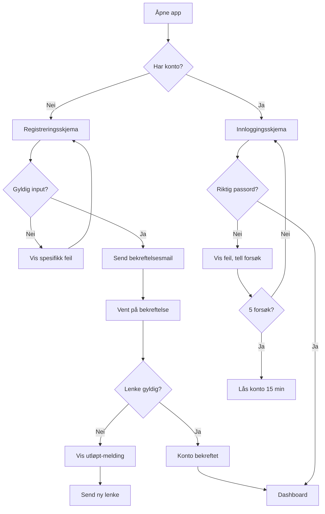

# Fase 2: Planlegg — Funksjoner, krav og sikkerhet

> **Mål:** Oversette visjonen til konkrete, byggbare krav som AI kan implementere presist.
>
> **Målgruppe:** Ikke-tekniske vibekodere i rollen som prosjektleder, samt AI-assistenter.

---

## 0. Input fra Fase 1

- Idé og visjon etablert (fra Fase 1: Idé og visjon)
- Prosjektklassifisering fullført (fra `Kit CC/Agenter/agenter/system/agent-AUTO-CLASSIFIER.md`)
- Målgruppe og personas definert
- Konkurrentanalyse gjennomført
- Risikovurdering påbegynt

---

## Innholdsfortegnelse

### Forutsetninger
0. [Input fra Fase 1](#0-input-fra-fase-1)

### Del A: Grunnlag og Forberedelse
1. [Hvorfor er denne fasen kritisk?](#1-hvorfor-er-denne-fasen-kritisk)
2. [Spec-Driven Development (SDD)](#2-spec-driven-development-sdd)
3. [Prosjektklassifisering](#3-prosjektklassifisering)

### Del B: Kjernekomponenter (Kritiske 🔴)
4. [Brukerhistorier med akseptkriterier](#4-brukerhistorier-med-akseptkriterier-)
5. [Sikkerhetskrav](#5-sikkerhetskrav-)
6. [Funksjonsliste med prioritering](#6-funksjonsliste-med-prioritering-)
7. [MVP-definisjon](#7-mvp-definisjon-)
8. [Brukerflyt](#8-brukerflyt-)
9. [Edge cases og feilhåndtering](#9-edge-cases-og-feilhåndtering-)

### Del C: AI-Spesifikk Dokumentasjon (Kritisk 🔴)
10. [AI-kontekst og regler](#10-ai-kontekst-og-regler-)
11. [Maskinlesbare spesifikasjoner](#11-maskinlesbare-spesifikasjoner-)
12. [Oppgavenedbrytning for AI](#12-oppgavenedbrytning-for-ai-)
12b. [Modulregister — Fra funksjoner til byggbare moduler](#12b-modulregister--fra-funksjoner-til-byggbare-moduler-)

### Del D: Viktige Tilleggskrav (🟡)
13. [Ikke-funksjonelle krav](#13-ikke-funksjonelle-krav-)
14. [Datamodell](#14-datamodell-)
15. [Wireframes og visuell spesifikasjon](#15-wireframes-og-visuell-spesifikasjon-)
16. [Personvern (GDPR) og regulatoriske krav](#16-personvern-gdpr-og-regulatoriske-krav-)
17. [Plattformspesifikke krav](#17-plattformspesifikke-krav-)

### Del E: Valgfrie Elementer (🟢)
18. [Internasjonalisering](#18-internasjonalisering-)

### Del F: Kvalitetssikring og Validering
19. [Spec-validering og kvalitetskontroll](#19-spec-validering-og-kvalitetskontroll)
20. [Håndtering av spec-drift](#20-håndtering-av-spec-drift)

### Del G: Leveranser og Sjekklister
21. [Leveranser fra Fase 2](#21-leveranser-fra-fase-2)
22. [Komplett sjekkliste før Fase 3](#22-komplett-sjekkliste-før-fase-3)

### Vedlegg
- [Vedlegg A: Kravspesifikasjon-mal](#vedlegg-a-kravspesifikasjon-mal)
- [Vedlegg B: AI-kontekstfil-mal](#vedlegg-b-ai-kontekstfil-mal)
- [Vedlegg C: Ordliste for ikke-tekniske](#vedlegg-c-ordliste-for-ikke-tekniske)

---

# 0. Input fra Fase 1

Før du starter Fase 2, må du ha følgende leveranser fra Fase 1:

## Obligatorisk
- **CLAUDE.md** – AI-kontekstfil med prosjektoversikt
- **Prosjektbeskrivelse** – 1-2 siders oversikt over hva du bygger
- **Persona** – Beskriving av primærbruker
- **Problemdefinisjon** – Klar problemsetning i én setning
- **Verdiforslag** – Hva problemet løses med
- **MoSCoW-prioritering** – Funksjonsliste prioritert i Must/Should/Could/Won't Have
- **Risikoregister** – Identifiserte risiko, spesielt AI-relatert
- **Go/No-Go beslutning** – Bekreftet at det er OK å gå videre

## Anbefalt
- **Lean Canvas** – Business model overview
- **Intervjuoppsummering** – Insights fra brukerintervjuer (min 5)
- **Teknisk mulighetsvurdering** – Bekreftet at idéen er teknisk gjennomførbar
- **Dataklassifisering** – Oversikt over datatyper som skal håndteres
- **Regulatorisk sjekkliste** – Identifisert compliance-krav (GDPR, etc.)

> **Hva gjøre hvis noe mangler?** Gå tilbake til Fase 1 og fullfør. Fase 2 bygger direkte på Fase 1-resultatene.

---

### Automatisk tilpasning og verktøy

- **Intensitetstilpasning:** Prioriteringer og krav tilpasses automatisk basert på prosjektets klassifisering (Enkelt hobbyprosjekt → Stort kritisk system). Hva som er obligatorisk, anbefalt eller valgfritt avhenger av prosjekttypen.
- **Kit CC Monitor:** AI-assistenten bruker Kit CC Monitor (en lokal webserver) for å overvåke nettleserfeil, kjøre debug-probes og vise prosjektstatus i sanntid.
- **Automatisk logging:** All fremdrift logges automatisk til PROGRESS-LOG.md. Du trenger ikke gjøre noe — AI-en håndterer dette.

---

# Del A: Grunnlag og Forberedelse

---

## 1. Hvorfor er denne fasen kritisk?

### Hva dette punktet består av
En forklaring på hvorfor kravspesifikasjon er spesielt viktig når du bruker AI til å skrive kode (VIBE-koding), sammenlignet med tradisjonell utvikling.

### Hva problemet er
I tradisjonell utvikling kan erfarne utviklere tolke vage krav basert på erfaring og sunn fornuft. De kan spørre oppklarende spørsmål og gjøre rimelige antakelser.

**AI-assistenter fungerer annerledes:**
- De tar instruksjoner bokstavelig
- De gjetter når noe er uklart (og gjettingene kan være feil)
- De husker ikke kontekst mellom sesjoner
- De kan ikke "lese mellom linjene"

**Statistikk som viser problemet:**
- 45% av AI-generert kode feiler på sikkerhetstester (Veracode, 2025)
- Utilstrekkelige krav er årsaken til nesten 50% av alle programvarefeil
- GitHub-studie av 2500+ agent-filer viste at de fleste feiler fordi de er "for vage"

### Hva vi oppnår ved å løse det
- **Presisjon:** AI genererer kode som faktisk gjør det du ønsker
- **Konsistens:** Samme kvalitet og stil gjennom hele prosjektet
- **Færre feil:** Reduserer behovet for omskriving og debugging
- **Tidsbesparelse:** Mindre tid på å korrigere misforståelser
- **Sikkerhet:** Unngår de vanligste sikkerhetsrisikoene

### Hvordan vi går frem
1. Bruk dette dokumentet som veiledning gjennom hele Fase 2
2. Følg strukturen og fyll ut malene grundig
3. Vær eksplisitt - det som virker "opplagt" for deg er ikke opplagt for AI
4. Test spesifikasjonene dine ved å forestille deg at en robot skal følge dem bokstavelig

### Viktig tilleggsinformasjon
> **For ikke-tekniske:** Tenk på AI som en ekstremt kompetent, men bokstavelig assistent. Hvis du ber noen "lage en fin knapp", kan et menneske tolke hva "fin" betyr. AI trenger å vite: hvilken farge, størrelse, plassering, hva som skjer når man klikker, osv.

---

## 2. Spec-Driven Development (SDD)

### Hva dette punktet består av
Spec-Driven Development er en metodikk der du skriver detaljerte spesifikasjoner *før* du ber AI om å generere kode. Spesifikasjonen blir "kilden til sannhet" for hele prosjektet.

### Hva problemet er
Mange som starter med VIBE-koding gjør det slik:
1. Skriv en vag prompt → 2. Få kode → 3. Se at det ikke fungerer → 4. Prøv igjen

Dette kalles "trial and error" og fører til:
- Inkonsistent kode (AI løser samme problem forskjellig hver gang)
- Sikkerhetshull (AI glemmer sikkerhet hvis du ikke spør)
- Frustrasjon og tapt tid
- Teknisk gjeld som hoper seg opp

### Hva vi oppnår ved å løse det
Ved å bruke SDD får du:
- **Forutsigbarhet:** Du vet hva du får før du starter
- **Dokumentasjon:** Spesifikasjonen *er* dokumentasjonen
- **Enklere vedlikehold:** Nye AI-sesjoner kan lese spesifikasjonen
- **Bedre kommunikasjon:** Alle interessenter kan lese og godkjenne spesifikasjonen

### Hvordan vi går frem

**SDD-arbeidsflyten:**

```
┌─────────────┐     ┌─────────────┐     ┌─────────────┐     ┌─────────────┐
│  SPECIFY    │ →   │    PLAN     │ →   │    TASKS    │ →   │   EXECUTE   │
│             │     │             │     │             │     │             │
│ Skriv krav  │     │ AI lager    │     │ Del opp i   │     │ AI koder    │
│ og regler   │     │ teknisk     │     │ små         │     │ én oppgave  │
│             │     │ plan        │     │ oppgaver    │     │ om gangen   │
└─────────────┘     └─────────────┘     └─────────────┘     └─────────────┘
       ↑                                                           │
       └───────────────── FEEDBACK LOOP ───────────────────────────┘
```

**De fire fasene:**

| Fase | Hvem gjør det | Hva skjer |
|------|---------------|-----------|
| **Specify** | Du (prosjektleder) | Skriver krav, regler, begrensninger |
| **Plan** | AI (med din godkjenning) | Foreslår teknisk løsning og arkitektur |
| **Tasks** | AI (med din godkjenning) | Bryter ned i små, konkrete oppgaver |
| **Execute** | AI | Skriver kode for én oppgave om gangen |

### Viktig tilleggsinformasjon

**Grunnprinsipper for SDD:**
1. **Spesifikasjon først, kode etterpå** - Aldri start å kode før spesifikasjonen er klar
2. **Spesifikasjonen er sannheten** - Ved uenighet, stol på spesifikasjonen
3. **Eksplisitt over implisitt** - Skriv ut alt, anta ingenting
4. **Versjonskontroll** - Behandle spesifikasjoner som kode (lagre, versjonér, spor endringer)

> **For ikke-tekniske:** SDD er som å lage en detaljert oppskrift før du begynner å lage mat. Du bestemmer alle ingredienser og steg på forhånd, slik at hvem som helst kan følge oppskriften og få samme resultat.

---

## 3. Prosjektklassifisering

### Hva dette punktet består av
En kategorisering av prosjektet ditt som bestemmer hvor mye dokumentasjon og sikkerhet du trenger. Ikke alle prosjekter trenger samme nivå av grundighet.

### Hva problemet er
Uten klassifisering risikerer du:
- **Over-dokumentering:** Bruker uker på spesifikasjon for et enkelt verktøy
- **Under-dokumentering:** Hopper over kritiske sikkerhetskrav for en kundevendt app
- **Feil prioritering:** Fokuserer på feil ting

### Hva vi oppnår ved å løse det
- Riktig mengde arbeid for riktig type prosjekt
- Tydelige forventninger til sikkerhetsnivå
- Effektiv bruk av tid og ressurser

### Hvordan vi går frem

**Velg din prosjekttype:**

| Type | Beskrivelse | Eksempler |
|------|-------------|-----------|
| **A: Lite internt verktøy** | Kun for deg/teamet, ingen sensitiv data | Skript, kalkulatorer, interne dashboards |
| **B: Internt system med database** | Bedriftsdata, flere brukere internt | CRM, prosjektstyringsverktøy, rapportsystemer |
| **C: Kundevendt applikasjon** | Eksterne brukere, persondata | Nettbutikk, booking-system, medlemsportal |
| **D: Stor skala / kritisk** | Høy risiko, regulert bransje | Bank, helse, offentlig sektor |

**Hva hver type krever:**

| Element | Type A | Type B | Type C | Type D |
|---------|--------|--------|--------|--------|
| Brukerhistorier | Enkel liste | Strukturert | Komplett | Komplett + review |
| Sikkerhetskrav | Basis | L1 | L2 | L2/L3 |
| MVP-definisjon | Uformell | Dokumentert | Dokumentert | Formelt godkjent |
| GDPR | Ikke nødvendig | Vurder | Påkrevd | Påkrevd + DPO |
| Testing | Manuell | Delvis auto | Automatisert | Automatisert + penetrasjonstest |

### Viktig tilleggsinformasjon

**Hvordan velge riktig:**

Svar på disse spørsmålene:
1. Hvem skal bruke systemet? (Kun meg / Teamet / Kunder / Alle)
2. Hvilke data håndteres? (Ingen sensitiv / Bedriftsdata / Persondata / Helse/finans)
3. Hva skjer hvis det feiler? (Irriterende / Problematisk / Alvorlig / Katastrofalt)
4. Er det regulatoriske krav? (Nei / GDPR / Bransje-spesifikke / Flere)

> **For ikke-tekniske:** Dette er som å velge forsikringsnivå. En sykkel trenger ikke samme forsikring som en bil. På samme måte trenger en enkel kalkulator ikke samme sikkerhetsnivå som en nettbank.

---

# Del B: Kjernekomponenter (Kritiske 🔴)

---

## 4. Brukerhistorier med akseptkriterier 🔴

### Hva dette punktet består av
En brukerhistorie beskriver én funksjon fra brukerens perspektiv. Den forteller *hvem* som trenger noe, *hva* de trenger, og *hvorfor* de trenger det. Akseptkriterier definerer eksakt når funksjonen er "ferdig".

### Hva problemet er
**Uten gode brukerhistorier:**
- AI vet ikke hvem den bygger for
- Du vet ikke når noe er "ferdig"
- Funksjoner blir enten for enkle eller for komplekse
- Ulike deler av systemet passer ikke sammen

**Vanlige feil:**
- "Lag en innloggingsside" - For vagt, mangler detaljer
- "Brukeren kan logge inn med e-post og passord og det skal være sikkert og raskt og fungere på mobil og..." - For mye på én gang

### Hva vi oppnår ved å løse det
- **Klarhet:** Alle vet nøyaktig hva som skal bygges
- **Testbarhet:** Akseptkriterier kan verifiseres objektivt
- **Prioritering:** Enklere å bestemme hva som er viktigst
- **Kommunikasjon:** Felles forståelse mellom alle involverte

### Hvordan vi går frem

**Standardformat for brukerhistorier:**

```
KRAV-ID: US-XXX
Prioritet: Must Have / Should Have / Could Have / Won't Have

Som [brukerrolle]
vil jeg [handling/funksjon]
slik at [mål/verdi]

Akseptkriterier:
- Gitt [forutsetning], når [handling], så [resultat]
- Gitt [forutsetning], når [handling], så [resultat]

Notater:
- [Tekniske notater, avklaringer, begrensninger]
```

**Eksempel - God brukerhistorie:**

```
KRAV-ID: US-001
Prioritet: Must Have

Som innlogget bruker
vil jeg nullstille passordet mitt via e-post
slik at jeg kan få tilgang til kontoen min hvis jeg glemmer passordet

Akseptkriterier:
- Gitt at jeg er på innloggingssiden, når jeg klikker "Glemt passord",
  så ser jeg et felt for e-postadresse
- Gitt at jeg skriver inn en registrert e-post, når jeg klikker "Send",
  så mottar jeg e-post innen 2 minutter
- Gitt at jeg klikker lenken i e-posten, når det har gått mindre enn 24 timer,
  så kan jeg sette nytt passord
- Gitt at jeg klikker lenken i e-posten, når det har gått mer enn 24 timer,
  så ser jeg melding om at lenken er utløpt
- Gitt at jeg setter nytt passord, når passordet oppfyller sikkerhetskravene,
  så blir jeg logget inn automatisk
- Gitt at jeg setter nytt passord, så blir alle eksisterende sesjoner ugyldiggjort

Notater:
- Passordkrav: min 12 tegn, minst én stor bokstav, ett tall, ett spesialtegn
- E-post sendes via SendGrid
- Lenken skal inneholde kryptert token, ikke bruker-ID
```

**INVEST-sjekklisten:**

Hver brukerhistorie bør oppfylle INVEST-kriteriene:

| Bokstav | Betydning | Spørsmål å stille |
|---------|-----------|-------------------|
| **I** | Independent (Uavhengig) | Kan denne bygges uten å vente på andre funksjoner? |
| **N** | Negotiable (Forhandlingsbar) | Er detaljene fleksible, eller er dette hugget i stein? |
| **V** | Valuable (Verdifull) | Gir dette reell verdi for brukeren? |
| **E** | Estimable (Estimerbar) | Kan vi anslå hvor lang tid dette tar? |
| **S** | Small (Liten) | Er dette lite nok til å fullføre i én arbeidsøkt? |
| **T** | Testable (Testbar) | Kan vi objektivt si om dette fungerer eller ikke? |

### Viktig tilleggsinformasjon

**Brukerroller - definer disse først:**

Før du skriver historier, definer alle brukerroller:

| Rolle | Beskrivelse | Typiske behov |
|-------|-------------|---------------|
| Gjest | Ikke-innlogget besøkende | Se info, registrere seg |
| Bruker | Innlogget standardbruker | Bruke hovedfunksjonene |
| Premium-bruker | Betalende bruker | Ekstra funksjoner |
| Admin | Administrator | Administrere brukere, se statistikk |

> **For ikke-tekniske:** En brukerhistorie er som en "mini-bestilling" fra en kunde. Tenk deg at hver funksjon er en rett på en meny. Brukerhistorien beskriver hva retten er, hvem den er for, og nøyaktig hva som må være på tallerkenen for at kunden skal være fornøyd.

**Kobling til testing (nytt for SDD):**

I Spec-Driven Development blir akseptkriteriene automatisk til tester. Skriv dem derfor slik at de kan verifiseres av en maskin:

```
# Dette kan bli en automatisk test:
Gitt at jeg er på innloggingssiden
Når jeg skriver inn feil passord 5 ganger
Så ser jeg meldingen "Kontoen er låst i 15 minutter"
Og jeg kan ikke logge inn selv med riktig passord
```

---

## 5. Sikkerhetskrav 🔴

### Hva dette punktet består av
En systematisk gjennomgang av sikkerhetsaspekter som må bygges inn i applikasjonen fra starten. Dette inkluderer autentisering (hvem er du?), autorisering (hva kan du gjøre?), datahåndtering, og logging.

### Hva problemet er
**Hvorfor dette er kritisk for VIBE-koding:**

Forskning viser alarmerende tall:
- **45% av AI-generert kode** feiler på sikkerhetstester (Veracode, 2025)
- **40% av GitHub Copilot-genererte programmer** har sårbarheter
- De vanligste feilene: manglende tilgangskontroll, hardkodede passord, usanitert input

**AI "glemmer" sikkerhet hvis du ikke spør eksplisitt.**

Typiske AI-genererte sikkerhetsfeil:
- Lagrer passord i klartekst
- Stoler på data fra brukerens nettleser
- Mangler rate-limiting (noen kan prøve millioner av passord)
- Viser tekniske feilmeldinger til brukere
- Logger sensitiv informasjon

### Hva vi oppnår ved å løse det
- **Beskyttelse av brukere:** Deres data er trygge
- **Beskyttelse av deg:** Unngår databrudd og juridiske problemer
- **Tillit:** Brukere stoler på systemet ditt
- **Compliance:** Oppfyller GDPR og andre krav
- **Fremtidssikring:** Lettere å legge til sikkerhet senere når grunnmuren er god

### Hvordan vi går frem

**Steg 1: Velg sikkerhetsnivå**

| Nivå | Beskrivelse | Når brukes det |
|------|-------------|----------------|
| **L1** | Standard sikkerhet | De fleste apper, lav-moderat risiko |
| **L2** | Sensitiv data | Personopplysninger, helse, finans |
| **L3** | Kritisk sikkerhet | Bank, offentlig sektor, medisinsk |

**Steg 2: Gå gjennom sikkerhetskrav-kategoriene**

#### A. Autentisering (Hvem er du?)

| Krav-ID | Krav | L1 | L2 | L3 | Forklaring for ikke-tekniske |
|---------|------|----|----|-----|------------------------------|
| SEC-A01 | Passord minimum 12 tegn med kompleksitet | 🔴 | 🔴 | 🔴 | Korte passord kan gjettes raskt |
| SEC-A02 | Passord lagres som salted hash (bcrypt/argon2) | 🔴 | 🔴 | 🔴 | Selv om databasen hackes, er passordene uleselige |
| SEC-A03 | Brute-force beskyttelse (maks 5 forsøk, 15 min lockout) | 🔴 | 🔴 | 🔴 | Stopper hackere fra å prøve tusenvis av passord |
| SEC-A04 | Sikker sesjonshåndtering (HTTP-only cookies) | 🔴 | 🔴 | 🔴 | Hindrer at ondsinnet kode stjeler innloggingen din |
| SEC-A05 | Sesjons-timeout ved inaktivitet | 🟡 | 🔴 | 🔴 | Logger deg ut hvis du glemmer å logge ut |
| SEC-A06 | Tofaktorautentisering (2FA) | 🟢 | 🟡 | 🔴 | Ekstra sikkerhetslag med kode på mobil |
| SEC-A07 | Passordfri autentisering (passkeys) | 🟢 | 🟢 | 🟡 | Moderne, sikrere alternativ til passord |

#### B. Autorisering (Hva kan du gjøre?)

| Krav-ID | Krav | L1 | L2 | L3 | Forklaring for ikke-tekniske |
|---------|------|----|----|-----|------------------------------|
| SEC-B01 | Rollebasert tilgangskontroll (RBAC) | 🔴 | 🔴 | 🔴 | Forskjellige brukere kan gjøre forskjellige ting |
| SEC-B02 | Brukere ser kun egne data (ressurs-eierskap) | 🔴 | 🔴 | 🔴 | Ola kan ikke se Karis data |
| SEC-B03 | Minste privilegium-prinsipp | 🔴 | 🔴 | 🔴 | Gi kun tilgang til det som trengs |
| SEC-B04 | API-endepunkter krever autentisering | 🔴 | 🔴 | 🔴 | Alle "bakdører" er også låst |
| SEC-B05 | Admin-funksjoner har ekstra bekreftelse | 🟡 | 🔴 | 🔴 | "Er du sikker på at du vil slette alle brukere?" |

#### C. Input-validering og datahåndtering

| Krav-ID | Krav | L1 | L2 | L3 | Forklaring for ikke-tekniske |
|---------|------|----|----|-----|------------------------------|
| SEC-C01 | Server-side input-validering | 🔴 | 🔴 | 🔴 | Stol aldri på data fra brukerens nettleser |
| SEC-C02 | Output-encoding for XSS-forebygging | 🔴 | 🔴 | 🔴 | Hindrer hackere fra å injisere ondsinnet kode |
| SEC-C03 | Parameteriserte spørringer (SQL injection) | 🔴 | 🔴 | 🔴 | Hindrer hackere fra å manipulere databasen |
| SEC-C04 | HTTPS alltid (TLS 1.2+) | 🔴 | 🔴 | 🔴 | All kommunikasjon er kryptert |
| SEC-C05 | Sensitiv data kryptert i database | 🟡 | 🔴 | 🔴 | Selv DBA kan ikke lese personnummer |
| SEC-C06 | Fileopplasting: valider type, størrelse, skan | 🟡 | 🔴 | 🔴 | Hindrer opplasting av virus |

#### D. Logging og overvåking

| Krav-ID | Krav | L1 | L2 | L3 | Forklaring for ikke-tekniske |
|---------|------|----|----|-----|------------------------------|
| SEC-D01 | Logg alle innlogginger (vellykket/feilet) | 🔴 | 🔴 | 🔴 | Spor hvem som har logget inn og når |
| SEC-D02 | Logg tilgangsendringer og admin-handlinger | 🟡 | 🔴 | 🔴 | Spor alle viktige endringer |
| SEC-D03 | Logger inneholder ikke sensitive data | 🔴 | 🔴 | 🔴 | Aldri logg passord eller personnummer |
| SEC-D04 | Varsling ved mistenkelig aktivitet | 🟢 | 🟡 | 🔴 | Automatisk varsel ved mulig angrep |

#### E. Rate Limiting

| Krav-ID | Krav | L1 | L2 | L3 | Forklaring for ikke-tekniske |
|---------|------|----|----|-----|------------------------------|
| SEC-E01 | API rate limiting per bruker/IP | 🟡 | 🔴 | 🔴 | Maks antall forespørsler per minutt |
| SEC-E02 | Innlogging rate limiting | 🔴 | 🔴 | 🔴 | Maks antall innloggingsforsøk |
| SEC-E03 | Passord-reset rate limiting | 🔴 | 🔴 | 🔴 | Maks antall "glemt passord"-forespørsler |

### Viktig tilleggsinformasjon

**Sikkerhetsprompt for AI:**

Når du ber AI om å kode, inkluder alltid dette i konteksten:

```markdown
## Sikkerhetskrav som ALLTID gjelder

Du skal ALLTID implementere følgende sikkerhetsprinsipper:

1. ALDRI stol på input fra klienten - valider ALT server-side
2. ALDRI lagre passord i klartekst - bruk bcrypt med cost 12+
3. ALDRI vis tekniske feilmeldinger til brukere
4. ALDRI logg sensitive data (passord, tokens, personnummer)
5. ALLTID bruk parameteriserte database-spørringer
6. ALLTID sjekk at brukeren har tilgang til ressursen de ber om
7. ALLTID bruk HTTPS
8. ALLTID sett sikre cookie-flagg (HttpOnly, Secure, SameSite)
```

**OWASP Top 10 2025 - De vanligste sårbarhetene:**

| # | Sårbarhet | Hva det betyr | Hvordan unngå |
|---|-----------|---------------|---------------|
| 1 | Broken Access Control | Brukere kan gjøre ting de ikke skal | Sjekk tilgang på hver forespørsel |
| 2 | Cryptographic Failures | Dårlig eller manglende kryptering | Bruk moderne kryptering, HTTPS |
| 3 | Injection | Ondsinnet kode i input | Valider og sanitér all input |
| 4 | Insecure Design | Manglende sikkerhetstanke | Tenk sikkerhet fra starten |
| 5 | Security Misconfiguration | Feil oppsett | Følg beste praksis |

> **For ikke-tekniske:** Sikkerhet er som låser på et hus. Du trenger lås på ytterdøren (autentisering), men også på individuelle rom (autorisering). Du trenger alarm (logging) og kanskje overvåkningskamera (overvåking). Jo mer verdifullt innholdet er, jo bedre sikring trenger du.

---

## 6. Funksjonsliste med prioritering 🔴

### Hva dette punktet består av
En komplett liste over alle funksjoner i systemet, organisert etter prioritet. Hver funksjon har en unik ID, er koblet til brukerhistorier, og viser avhengigheter til andre funksjoner.

### Hva problemet er
**Uten prioritert funksjonsliste:**
- Du vet ikke hva som skal bygges først
- Alt virker like viktig (men det er det ikke)
- Du risikerer å bruke tid på "nice-to-have" før "must-have"
- AI får ingen veiledning om rekkefølge
- Scope-creep: Prosjektet vokser ukontrollert

**Typisk feil:** "Vi trenger innlogging, dashboard, rapporter, eksport, admin-panel, mørk modus, og integrasjon med 5 andre systemer - alt til lansering!"

### Hva vi oppnår ved å løse det
- **Fokus:** Vet nøyaktig hva som er viktigst
- **Realistisk planlegging:** Kan estimere arbeidsmengde
- **Klare avhengigheter:** Vet hva som må bygges før hva
- **Bedre kommunikasjon:** Alle er enige om prioritet
- **MVP-klarhet:** Tydelig hva som er minimum for lansering

### Hvordan vi går frem

**MoSCoW-metoden for prioritering:**

| Prioritet | Betydning | Tommelfingerregel |
|-----------|-----------|-------------------|
| **Must have** | Produktet fungerer ikke uten | Maks 60% av totalt scope |
| **Should have** | Viktig, men kan utsettes til v1.1 | Inntil 20% |
| **Could have** | Ønskelig hvis tid tillater | Inntil 20% |
| **Won't have** | Bevisst utelatt fra denne versjonen | Dokumenter for fremtiden |

**Format for funksjonsliste:**

```markdown
## Funksjonsliste

### Must Have (MVP)
| ID | Funksjon | Beskrivelse | Brukerhistorie | Avhenger av |
|----|----------|-------------|----------------|-------------|
| F-001 | Brukerregistrering | Opprett konto med e-post/passord | US-001 | - |
| F-002 | Innlogging | Logg inn med e-post/passord | US-002 | F-001 |
| F-003 | E-postbekreftelse | Verifiser e-postadresse | US-001 | F-001 |
| F-004 | [Hovedfunksjon 1] | ... | US-010 | F-002 |

### Should Have
| ID | Funksjon | Beskrivelse | Brukerhistorie | Avhenger av |
|----|----------|-------------|----------------|-------------|
| F-010 | Passord-reset | Nullstill passord via e-post | US-003 | F-001 |
| F-011 | Profilredigering | Endre navn og bilde | US-004 | F-002 |

### Could Have
| ID | Funksjon | Beskrivelse | Brukerhistorie | Avhenger av |
|----|----------|-------------|----------------|-------------|
| F-020 | Mørk modus | Alternativt fargetema | US-020 | - |
| F-021 | Eksport til CSV | Last ned data | US-021 | F-004 |

### Won't Have (v1.0)
| ID | Funksjon | Begrunnelse | Planlagt versjon |
|----|----------|-------------|------------------|
| F-100 | Mobilapp | Fokuserer på web først | v2.0 |
| F-101 | Team-funksjoner | Krever ny arkitektur | v2.0 |
```

**Avhengighetsdiagram:**

Tegn opp avhengigheter for å se kritisk sti:

```
F-001 (Registrering)
    ├── F-002 (Innlogging)
    │       ├── F-004 (Hovedfunksjon 1)
    │       │       └── F-021 (Eksport)
    │       └── F-011 (Profilredigering)
    ├── F-003 (E-postbekreftelse)
    └── F-010 (Passord-reset)
```

### Viktig tilleggsinformasjon

**Test prioriteringen din:**

For hver "Must Have"-funksjon, spør:
1. "Kan brukeren oppnå hovedmålet uten denne funksjonen?"
2. "Finnes det en manuell workaround?"
3. "Hva er konsekvensen av å utsette til v1.1?"

Hvis svaret er "ja, de kan klare seg uten" → flytt til Should Have.

> **For ikke-tekniske:** Prioritering er som å pakke koffert til en tur. Must Have = undertøy og tannbørste. Should Have = ekstra sko. Could Have = ekstra jakke i tilfelle. Won't Have = surfebrettet (denne gangen). Alt får ikke plass, så du må velge det viktigste.

---

## 7. MVP-definisjon 🔴

### Hva dette punktet består av
MVP (Minimum Viable Product) er den enkleste versjonen av produktet som gir verdi til brukeren. Det er ikke et "dårlig produkt" - det er et fokusert produkt med færre funksjoner, men der hver funksjon fungerer perfekt.

### Hva problemet er
**Vanlige misforståelser om MVP:**
- "MVP betyr halvferdig" - Feil! MVP betyr færre funksjoner, ikke dårligere kvalitet
- "Vi trenger alt før lansering" - Feil! Du trenger nok til å teste hypotesen
- "Vi kan legge til sikkerhet senere" - Farlig feil! Sikkerhet må være der fra dag 1

**Uten klar MVP-definisjon:**
- Prosjektet tar evig tid
- Du vet ikke når du er "ferdig"
- Alle har forskjellig oppfatning av hva som skal med
- Du bygger funksjoner ingen bruker

### Hva vi oppnår ved å løse det
- **Raskere til markedet:** Lansér noe brukbart raskt
- **Læring:** Få tilbakemeldinger fra ekte brukere
- **Fokus:** Alle jobber mot samme mål
- **Ressurseffektivitet:** Ikke bygg det ingen trenger
- **Iterasjon:** Bygg videre basert på reelle data

### Hvordan vi går frem

**MVP-definisjonsmal:**

```markdown
## MVP-definisjon

### Hovedmål
[Én setning som beskriver hva brukeren skal kunne oppnå]

Eksempel: "Brukeren kan registrere og spore daglige arbeidstimer på prosjekter."

### MVP-funksjoner (kun Must Have)
1. F-001: Brukerregistrering
2. F-002: Innlogging
3. F-003: Legge inn timer
4. F-004: Se liste over registrerte timer

### Bevisst IKKE i MVP (med begrunnelse)
| Funksjon | Hvorfor ikke i MVP | Workaround |
|----------|-------------------|------------|
| Redigere timer | Kan slette og legge inn på nytt | Manuell |
| Rapporter | Kan eksportere rå data | Manuell i Excel |
| Admin-panel | Kan bruke database direkte | Teknisk workaround |
| Mobilapp | Responsiv web fungerer | Bruk nettleser |

### MVP-suksesskriterier
MVP er vellykket hvis:
- [ ] 10 testbrukere kan fullføre hovedoppgaven uten hjelp
- [ ] Gjennomsnittlig tid for hovedoppgaven < 2 minutter
- [ ] Ingen kritiske feil i løpet av 2 ukers testing
- [ ] Net Promoter Score > 7

### MVP-tidslinje
- Estimert utviklingstid: [X uker]
- Planlagt intern test: [dato]
- Planlagt beta-lansering: [dato]
```

**MVP-test - "Mom Test":**

Kan du forklare MVP-en din til noen uten teknisk bakgrunn på 30 sekunder?

Eksempel:
- ❌ "Det er en SaaS-plattform med REST API, OAuth2, og PostgreSQL backend for tidssporing med multi-tenant arkitektur"
- ✅ "Det er en app der du logger arbeidstimene dine på forskjellige prosjekter"

### Viktig tilleggsinformasjon

**MVP-antipatterns (ting du IKKE skal gjøre):**

| Antipattern | Problem | Løsning |
|-------------|---------|---------|
| "MVP + én ting til" | Scope-creep | Vær streng med grensen |
| "Midlertidig løsning" | Blir permanent | Gjør det ordentlig eller ikke i det hele tatt |
| "Vi fikser sikkerhet senere" | Sikkerhetsgjeld | Sikkerhet er alltid Must Have |
| "Alle konkurrenter har det" | Feature-envy | Fokuser på din unike verdi |

> **For ikke-tekniske:** MVP er som å åpne en ny restaurant. Du starter ikke med 50 retter på menyen. Du starter med 5 retter som du kan perfekt, får tilbakemeldinger, og utvider menyen basert på hva gjestene faktisk vil ha.

---

## 8. Brukerflyt 🔴

### Hva dette punktet består av
Brukerflyt (user flow) er en steg-for-steg beskrivelse av hvordan en bruker navigerer gjennom applikasjonen for å oppnå et mål. Den viser alle mulige veier - både "happy path" (alt går bra) og "unhappy path" (noe går galt).

### Hva problemet er
**Uten dokumenterte brukerflyter:**
- Du oppdager manglende skjermer sent i utviklingen
- Feilscenarier blir ikke håndtert
- Brukeropplevelsen blir inkonsistent
- AI vet ikke hvordan skjermer henger sammen
- Testing blir tilfeldig

**Typisk feil:** Du planlegger innloggingssiden, men glemmer:
- Hva skjer hvis e-posten ikke finnes?
- Hva skjer ved feil passord?
- Hva skjer etter 5 feilede forsøk?
- Hvor går brukeren etter innlogging?

### Hva vi oppnår ved å løse det
- **Komplett oversikt:** Ser alle skjermer og overganger
- **Feilhåndtering:** Planlegger for alt som kan gå galt
- **Bedre UX:** Gjennomtenkt brukerreise
- **Testgrunnlag:** Vet nøyaktig hva som skal testes
- **AI-vennlig:** Gir AI klar kontekst

### Hvordan vi går frem

**Format 1: Tekstbasert flyt**

```
FLYT: Registrering og første bruk
Mål: Ny bruker oppretter konto og kommer til dashboard

1. Bruker åpner app → Ser landingsside
2. Klikker "Registrer" → Ser registreringsskjema
3. Fyller inn e-post, passord, bekreft passord
   → FEIL: E-post finnes allerede → Vis "E-post er registrert. Logg inn?"
   → FEIL: Passord for svakt → Vis krav som ikke er oppfylt
   → FEIL: Passordene matcher ikke → Vis "Passordene matcher ikke"
4. Klikker "Opprett konto" → Ser "Sjekk e-posten din"
5. Åpner e-post → Klikker bekreftelseslenke
   → FEIL: Lenke utløpt (>24t) → Vis "Lenken er utløpt" + send ny
   → FEIL: Lenke allerede brukt → Vis "Kontoen er allerede bekreftet"
6. Ser "Konto bekreftet" → Automatisk innlogget
7. Ser dashboard med velkomstmelding og onboarding-tips
```

**Format 2: Mermaid-diagram (AI kan generere dette)**



**Sjekkliste for hver flyt - "Unhappy paths":**

For hver flyt, dokumenter hva som skjer når:

| Scenario | Spørsmål å stille |
|----------|-------------------|
| Ugyldig input | Hva hvis brukeren skriver feil? |
| Nettverksfeil | Hva hvis internett er borte? |
| Timeout | Hva hvis serveren er treg? |
| Avbrytelse | Hva hvis brukeren lukker vinduet midt i? |
| Sesjonsutløp | Hva hvis brukeren er inaktiv for lenge? |
| Ressurs ikke funnet | Hva hvis dataen er slettet? |
| Manglende tilgang | Hva hvis brukeren ikke har rettigheter? |
| Dobbel-submit | Hva hvis brukeren klikker to ganger? |

### Viktig tilleggsinformasjon

**Hovedflyter du alltid trenger:**
1. Registrering (ny bruker)
2. Innlogging (eksisterende bruker)
3. Passord-reset
4. Hovedfunksjonen (det produktet gjør)
5. Utlogging

**Tips for AI-vennlige brukerflyter:**

Skriv flyter slik at AI kan generere kode direkte:

```
SKJERM: Innloggingsskjema
URL: /login

ELEMENTER:
- Overskrift: "Logg inn"
- Input: E-post (type: email, påkrevd)
- Input: Passord (type: password, påkrevd)
- Checkbox: "Husk meg" (valgfri)
- Knapp: "Logg inn" (submit)
- Lenke: "Glemt passord?" → /forgot-password
- Lenke: "Ny bruker? Registrer deg" → /register

OPPFØRSEL:
- Ved submit: Valider inputs → Send til API → Håndter respons
- Ved suksess: Redirect til /dashboard
- Ved feil: Vis feilmelding under skjemaet
```

> **For ikke-tekniske:** En brukerflyt er som et veikart. Den viser hovedveien fra A til B, men også alle avkjørsler og hva som skjer hvis du kjører feil. En god flyt har skilting for alle situasjoner - ikke bare når alt går perfekt.

---

## 9. Edge cases og feilhåndtering 🔴

### Hva dette punktet består av
Edge cases er spesielle situasjoner som ikke er hovedscenarioet, men som kan oppstå. Feilhåndtering beskriver hvordan systemet skal reagere når noe går galt - både hva brukeren ser og hva som skjer bak kulissene.

### Hva problemet er
**AI er notorisk dårlig på edge cases:**
- Den fokuserer på "happy path"
- Den glemmer feilhåndtering med mindre du spør
- Feilmeldinger blir generiske eller tekniske
- Sikkerhetshull oppstår i kantsituasjoner

**Eksempler på edge cases AI typisk glemmer:**
- Hva hvis brukeren laster opp en 2GB fil?
- Hva hvis noen prøver å slette sin egen admin-konto?
- Hva hvis to personer redigerer samme ting samtidig?
- Hva hvis noen har JavaScript avslått?

### Hva vi oppnår ved å løse det
- **Robust applikasjon:** Fungerer i alle situasjoner
- **God brukeropplevelse:** Brukeren forstår hva som gikk galt
- **Sikkerhet:** Kantsituasjoner utnyttes ikke av hackere
- **Redusert support:** Færre henvendelser om feil
- **Profesjonelt produkt:** Håndterer alt elegant

### Hvordan vi går frem

**Dokumentasjonsformat for edge cases:**

```markdown
## Edge Cases

### Funksjon: [Funksjonsnavn]

| ID | Scenario | Trigger | Forventet oppførsel | Teknisk notis |
|----|----------|---------|---------------------|---------------|
| EC-001 | E-post finnes | Registrering med eksisterende e-post | Vis "E-post er registrert. Vil du logge inn?" | Ikke avslør at e-posten finnes direkte |
| EC-002 | For svakt passord | Passord < 12 tegn | Vis hvilke krav som ikke er oppfylt | Liste over manglende krav |
| EC-003 | Nettverksfeil | API-kall feiler | Vis "Kunne ikke koble til. Prøv igjen." + retry-knapp | Automatisk retry 3 ganger først |
```

**Kategorier av edge cases:**

| Kategori | Eksempler | Typisk håndtering |
|----------|-----------|-------------------|
| **Ugyldig input** | Tomt felt, feil format, for langt | Spesifikk feilmelding, forhindre submit |
| **Grenser** | Maks filstørrelse, maks antall, tom liste | Tydelig kommunikasjon av grenser |
| **Duplikater** | E-post finnes, brukernavn tatt | Foreslå alternativer |
| **Tilstand** | Ikke innlogget, mangler tilgang | Redirect med forklaring |
| **Samtidighet** | To redigerer samtidig | Conflict resolution |
| **Teknisk** | Nettverksfeil, timeout, server nede | Brukervennlig feilside |

**Prinsipper for gode feilmeldinger:**

| ✅ Gjør | ❌ Ikke gjør |
|---------|-------------|
| Vær spesifikk om hva som er feil | Vis tekniske detaljer |
| Forklar hva brukeren kan gjøre | Vis stack traces |
| Bruk vanlig språk | Bruk teknisk sjargong |
| Gi mulighet til å prøve igjen | La brukeren sitte fast |
| Logg detaljer server-side | Vis database-feil til bruker |

**Eksempel på feilmeldings-konvertering:**

```
❌ Teknisk: "Error 500: NullPointerException at UserService.java:142"

✅ Brukervennlig: "Beklager, noe gikk galt. Prøv igjen om litt.
                   Hvis problemet fortsetter, kontakt support med kode: ERR-20240115-A3B."
```

### Viktig tilleggsinformasjon

**Sikkerhetshensyn i feilmeldinger:**

| Situasjon | ❌ Usikker melding | ✅ Sikker melding |
|-----------|-------------------|------------------|
| Feil innlogging | "Feil passord for ola@example.com" | "Feil e-post eller passord" |
| Bruker finnes ikke | "Ingen bruker med denne e-posten" | "Feil e-post eller passord" |
| Passord-reset | "E-post sendt til ola@example.com" | "Hvis e-posten er registrert, vil du motta en lenke" |

> **For ikke-tekniske:** Edge cases er som "hva-hvis"-scenarier. Hva hvis strømmen går under en transaksjon? Hva hvis noen prøver å betale med ugyldig kort? Et godt system har svar på alle disse spørsmålene - og gir brukeren tydelig beskjed om hva som skjedde og hva de kan gjøre.

---

# Del C: AI-Spesifikk Dokumentasjon (Kritisk 🔴)

---

## 10. AI-kontekst og regler 🔴

### Hva dette punktet består av
AI-kontekstfilen er et dokument som deles med AI ved hver kodesesjon. Den inneholder alt AI trenger for å generere konsistent kode: teknologivalg, kodestandarder, navnekonvensjoner, og forbudte mønstre.

### Hva problemet er
**Uten AI-kontekst:**
- AI bruker forskjellige teknologier i forskjellige sesjoner
- Kodestilen varierer (camelCase vs snake_case)
- AI velger tilfeldige biblioteker
- Tidligere beslutninger blir glemt

### Hva vi oppnår ved å løse det
- **Konsistens:** All kode følger samme mønstre
- **Effektivitet:** Slipper å gjenta grunnleggende info
- **Kvalitet:** AI følger beste praksis du har definert

### Hvordan vi går frem

**AI-kontekstfil-struktur:**

```markdown
# AI-kontekst: [Prosjektnavn]

## Teknologistack (IKKE AVVIK)
- Frontend: Next.js 14 med App Router
- Styling: Tailwind CSS + shadcn/ui
- Database: PostgreSQL med Prisma
- Autentisering: NextAuth.js

## Kodestandarder
- TypeScript strict mode
- Norske kommentarer, engelsk kode
- Server Components som default

## Navnekonvensjoner
| Type | Konvensjon | Eksempel |
|------|------------|----------|
| Komponenter | PascalCase | UserProfile.tsx |
| Funksjoner | camelCase | getUserById |
| Database | snake_case | user_sessions |

## FORBUDTE MØNSTRE
- ❌ `any` type i TypeScript
- ❌ Inline styles
- ❌ console.log i produksjon
- ❌ Hardkodede secrets
```

> **For ikke-tekniske:** AI-kontekstfilen er som stilguide for et magasin - den sikrer at alt ser ut som det hører sammen.

---

## 11. Maskinlesbare spesifikasjoner 🔴

### Hva dette punktet består av
Krav skrevet i strukturert format som AI kan tolke presist, med klare felt, typer og constraints.

### Hva problemet er
Vage beskrivelser fører til at AI gjetter feil.

### Hva vi oppnår ved å løse det
- **Presisjon:** AI vet eksakt hva den skal lage
- **Testbarhet:** Specs kan verifiseres automatisk

### Hvordan vi går frem

**Eksempel på maskinlesbar spec:**

```yaml
endpoint: POST /api/auth/register

input:
  email:
    type: string
    format: email
    required: true
  password:
    type: string
    minLength: 12
    validation:
      - pattern: "[A-Z]"
        message: "Må inneholde stor bokstav"

output:
  201: { userId: UUID, message: "Opprettet" }
  400: { code: "VALIDATION_ERROR", errors: [] }
```

> **For ikke-tekniske:** Maskinlesbare specs er som IKEA-instruksjoner med eksakte mål - ikke "fest på en god plass".

---

## 12. Oppgavenedbrytning for AI 🔴

### Hva dette punktet består av
Store funksjoner delt inn i små deloppgaver som AI kan fullføre én om gangen.

### Hva problemet er
Store oppgaver gjør at AI mister kontekst og lager feil som forplanter seg.

### Hva vi oppnår ved å løse det
- **Kontrollerbart:** Verifiser hver deloppgave
- **Reverserbart:** Lett å rulle tilbake
- **AI-optimalt:** Fungerer med AIs begrensninger

### Hvordan vi går frem

**Eksempel:**

```markdown
## Oppgave: Passord-reset

### Deloppgave 1: Database (15 min)
Filer: prisma/schema.prisma
- Legg til PasswordResetToken-modell
Akseptkriterier:
- [ ] Migrering kjører uten feil

### Deloppgave 2: Token-service (30 min)
Filer: src/server/services/password-reset.ts
- Lag createPasswordResetToken(email)
Akseptkriterier:
- [ ] Token er kryptografisk tilfeldig
- [ ] Lagret token er hashet

### Deloppgave 3: API-endepunkt (30 min)
...
```

**Tommelfingelregel:** Maks 1 time per deloppgave.

> **For ikke-tekniske:** Som å bygge LEGO - følg instruksjonene side for side, sjekk at hver del er riktig før du går videre.

---

## 12b. Modulregister — Fra funksjoner til byggbare moduler 🔴

### Hva dette punktet består av

**MODULREGISTER.md** er en sentral leveranse fra Fase 2. Det er et strukturert register der hver funksjon fra funksjonslisten (seksjon 6) og BRUKERENS-PLAN.md (fra Fase 1) formaliseres som en modul med unik ID, prioritet, avhengigheter og akseptkriterier.

### Hva problemet er

Uten et formelt modulregister:
- AI-assistenten vet ikke rekkefølgen funksjoner skal bygges i
- Avhengigheter mellom funksjoner er uklare
- Det er ingen entydig "master-liste" over hva som skal bygges
- Fase 5 (Bygg funksjonene) mangler en klar arbeidsplan

### Hva vi oppnår ved å løse det

- **Entydig arbeidsliste:** Hver modul har en unik ID som brukes gjennom hele prosjektet
- **Klar rekkefølge:** Avhengigheter viser hva som må bygges først
- **Sporbarhet:** Fra brukerønske (BRUKERENS-PLAN) → modul (MODULREGISTER) → kode
- **AI-optimalt:** AI jobber med én modul om gangen i Fase 5

### Hvordan vi går frem

AI-assistenten oppretter `docs/MODULREGISTER.md` basert på funksjonslisten og BRUKERENS-PLAN.md. Hver funksjon blir en modul:

**Format:**

```markdown
## MODULREGISTER

| Modul-ID | Navn | Prioritet | Avhenger av | Status | Akseptkriterier |
|----------|------|-----------|-------------|--------|-----------------|
| M-001 | Brukerregistrering | Must Have | - | Planlagt | Bruker kan opprette konto med e-post/passord |
| M-002 | Innlogging | Must Have | M-001 | Planlagt | Bruker kan logge inn og får sesjon |
| M-003 | Dashboard | Must Have | M-002 | Planlagt | Innlogget bruker ser oversikt over sine data |
| M-004 | Profilredigering | Should Have | M-002 | Planlagt | Bruker kan endre navn og profilbilde |
```

**Regler for modulregisteret:**
1. Hver modul har en unik ID (M-001, M-002, ...)
2. Prioritet følger MoSCoW fra funksjonslisten
3. Avhengigheter viser hvilke moduler som må være ferdige først
4. Akseptkriterier er hentet fra brukerhistoriene (seksjon 4)
5. Status oppdateres gjennom prosjektets livssyklus (Planlagt → Under arbeid → Ferdig → Godkjent)

**Modulregisteret er master-listen for Fase 5.** Når AI bygger funksjonene, itererer den over modulregisteret i rekkefølge, og bygger én modul om gangen.

### Viktig tilleggsinformasjon

Modulregisteret erstatter IKKE funksjonslisten (seksjon 6) eller brukerhistoriene (seksjon 4). Det er et operativt verktøy som kobler sammen krav og implementasjon.

> **For ikke-tekniske:** Tenk på modulregisteret som en byggeplan for et hus. Funksjonslisten er ønskelisten ("vi vil ha kjøkken, stue, bad"), mens modulregisteret er den detaljerte planen som viser rekkefølge ("først fundament, så vegger, så tak") og hva som avhenger av hva.

---

# Del D: Viktige Tilleggskrav (🟡)

---

## 13. Ikke-funksjonelle krav 🟡

### Hva dette punktet består av
Krav som ikke handler om *hva* systemet gjør, men *hvordan* det gjør det: hastighet, oppetid, skalerbarhet, tilgjengelighet.

### Hva problemet er
Funksjonelle krav alene gir ikke et godt produkt. En app som "fungerer" men bruker 30 sekunder på å laste, er ubrukelig.

### Hva vi oppnår ved å løse det
- **God brukeropplevelse:** Rask og responsiv
- **Pålitelighet:** Systemet er tilgjengelig
- **Tilgjengelighet:** Alle kan bruke det

### Hvordan vi går frem

```markdown
## Ikke-funksjonelle krav

### Ytelse
| Krav | Mål | Måling |
|------|-----|--------|
| Sideinnlasting | < 3 sek | Lighthouse |
| API-respons (P95) | < 500 ms | Server-metrikker |

### Oppetid
| Krav | Mål |
|------|-----|
| Tilgjengelighet | 99.5% |
| Maks nedetid/måned | 3.6 timer |

### Tilgjengelighet (a11y)
| Krav | Standard |
|------|----------|
| WCAG-nivå | AA |
| Tastaturnavigasjon | Full støtte |
| Skjermleser | Kompatibel |
```

> **For ikke-tekniske:** Ikke-funksjonelle krav er som krav til en bil utover "den kjører" - hvor rask, hvor trygg, hvor komfortabel.

---

## 14. Datamodell 🟡

### Hva dette punktet består av
En oversikt over alle datatyper (entiteter) i systemet, hvilke felter de har, og hvordan de henger sammen.

### Hva problemet er
Feil i datamodellen er svært kostbare å fikse senere. Alt bygger på datamodellen.

### Hva vi oppnår ved å løse det
- **Solid fundament:** Alt annet blir enklere
- **Konsistens:** Alle snakker om samme ting
- **Fremtidssikring:** Lettere å utvide

### Hvordan vi går frem

```markdown
## Datamodell

### User
| Felt | Type | Constraints | Beskrivelse |
|------|------|-------------|-------------|
| id | UUID | PK | Unik ID |
| email | String | Unique | E-postadresse |
| password_hash | String | Not Null | Hashet passord |
| role | Enum | Default: USER | USER, ADMIN |
| created_at | DateTime | Default: now() | Opprettet |

### Task
| Felt | Type | Constraints | Beskrivelse |
|------|------|-------------|-------------|
| id | UUID | PK | Unik ID |
| user_id | UUID | FK → User | Eier |
| title | String | Max 200 | Tittel |
| status | Enum | Default: PENDING | Status |

### Relasjoner
- User 1:N Task (én bruker har mange oppgaver)
```

> **For ikke-tekniske:** Datamodellen er som plantegningen for et hus - den viser alle rom og hvordan de henger sammen.

---

## 15. Wireframes og visuell spesifikasjon 🟡

### Hva dette punktet består av
Enkle skisser som viser layout og elementer på hver skjerm - ikke ferdig design, men struktur.

### Hva problemet er
Uten wireframes oppdager du manglende skjermer sent, og AI må gjette på layout.

### Hva vi oppnår ved å løse det
- **Visuell plan:** Alle ser hva som skal bygges
- **AI-input:** AI kan generere UI fra wireframes
- **Færre overraskelser:** Ingenting mangler

### Hvordan vi går frem

**ASCII-wireframe:**
```
┌─────────────────────────────────────┐
│  [Logo]              [Logg inn]     │
├─────────────────────────────────────┤
│  Mine oppgaver          [+ Ny]      │
│  ─────────────────────────────────  │
│  [ ] Kjøpe melk              I dag  │
│  [x] Sende e-post            I går  │
│  [ ] Møte med team        Om 2 dager│
└─────────────────────────────────────┘
```

**Verktøy:** Papir/blyant, Excalidraw, Figma

> **For ikke-tekniske:** Wireframes er som arkitektskisse før du bygger - viser romfordeling, ikke tapetfarger.

---

## 16. Personvern (GDPR) og regulatoriske krav 🟡

### Hva dette punktet består av
Krav fra GDPR og eventuelle andre reguleringer som gjelder for prosjektet.

### Hva problemet er
Manglende GDPR-compliance kan gi bøter på opptil 4% av global omsetning eller €20 millioner.

### Hva vi oppnår ved å løse det
- **Lovlydighet:** Unngår bøter
- **Tillit:** Brukere stoler på deg
- **Etikk:** Behandler data riktig

### Hvordan vi går frem

**GDPR gjelder hvis du:**
- Samler personopplysninger fra EU/EØS-borgere
- Inkluderer: navn, e-post, IP-adresse, cookies

**Hovedkrav:**

| Krav | Funksjon |
|------|----------|
| Samtykke | Checkbox ved registrering (ikke pre-checked) |
| Innsyn | "Se mine data"-side |
| Sletting | "Slett konto"-funksjon |
| Portabilitet | Eksport til JSON |
| Informasjon | Personvernerklæring |

> **For ikke-tekniske:** GDPR handler om å gi brukere kontroll over egne data - rett til å se, endre og slette.

---

## 17. Plattformspesifikke krav 🟡

### Hva dette punktet består av
Krav som gjelder for spesifikke plattformer: mobil (iOS/Android), PWA, desktop.

### Hva problemet er
Hver plattform har unike muligheter og begrensninger som må tas hensyn til.

### Hva vi oppnår ved å løse det
- **Optimal opplevelse:** Utnytter plattformens styrker
- **Sikkerhet:** Bruker plattformens sikkerhetsfunksjoner

### Hvordan vi går frem

**Mobilapp:**
- Sikker lagring (Keychain/Keystore)
- Biometrisk autentisering
- Push-notifikasjoner
- Offline-støtte

**PWA:**
- Web App Manifest
- Service Worker
- Installerbar

> **For ikke-tekniske:** Som å tilpasse en butikk til forskjellige lokasjoner - samme konsept, men tilpasset lokale forhold.

---

# Del E: Valgfrie Elementer (🟢)

---

## 18. Internasjonalisering 🟢

### Hva dette punktet består av
Støtte for flere språk og lokale formater (dato, tall, valuta).

### Hva problemet er
Å legge til språkstøtte i etterkant er mye vanskeligere enn å planlegge for det fra starten.

### Hva vi oppnår ved å løse det
- **Større marked:** Kan nå internasjonale brukere
- **Forberedt:** Enkelt å legge til språk senere

### Hvordan vi går frem

Hvis du trenger i18n:
- Hold alle tekster i språkfiler (ikke hardkodet)
- Bruk biblioteker som next-intl eller react-i18next
- Vurder formatering: dato, tall, valuta

Hvis du IKKE trenger i18n nå:
- Hold likevel tekster atskilt fra kode
- Gjør det enkelt å legge til senere

> **For ikke-tekniske:** Som å bygge et hus med strømuttak i alle rom - selv om du ikke trenger dem alle nå, er det mye enklere enn å legge dem inn senere.

---

# Del F: Kvalitetssikring og Validering

---

## 19. Spec-validering og kvalitetskontroll

### Hva dette punktet består av
Prosesser for å sjekke at spesifikasjonene er komplette, konsistente og AI-klare før du starter utvikling.

### Hva problemet er
Dårlige specs → dårlig kode → mye omarbeid. Bedre å finne feil i specs enn i kode.

### Hva vi oppnår ved å løse det
- **Færre overraskelser:** Finner hull før koding
- **Bedre AI-output:** Klare specs = bedre kode
- **Tidsbesparelse:** Mindre debugging

### Hvordan vi går frem

**Spec-kvalitetssjekkliste:**

| Kategori | Sjekk | ✓ |
|----------|-------|---|
| **Komplett** | Alle MVP-funksjoner har brukerhistorier | [ ] |
| **Komplett** | Alle brukerhistorier har akseptkriterier | [ ] |
| **Komplett** | Edge cases er dokumentert | [ ] |
| **Konsistent** | Samme termer brukes overalt | [ ] |
| **Konsistent** | Ingen motstridende krav | [ ] |
| **AI-klar** | Teknologistack er definert | [ ] |
| **AI-klar** | Navnekonvensjoner er dokumentert | [ ] |
| **AI-klar** | Forbudte mønstre er listet | [ ] |
| **Testbar** | Akseptkriterier kan verifiseres | [ ] |
| **Sikker** | Sikkerhetskrav er definert | [ ] |

**AI-assistert spec-review:**

Be AI om å gjennomgå specsen:

```
Gitt denne spesifikasjonen, identifiser:
1. Manglende informasjon
2. Tvetydige krav
3. Potensielle sikkerhetshull
4. Inkonsistens mellom seksjoner
5. Edge cases som ikke er dekket
```

---

## 20. Håndtering av spec-drift

### Hva dette punktet består av
Strategier for å holde spesifikasjon og kode synkronisert over tid, og oppdage når AI avviker fra spec.

### Hva problemet er
- AI kan "hallusinere" og lage noe annet enn spesifisert
- Specs blir utdaterte når koden endres
- Ingen vet hva som er "sannheten"

### Hva vi oppnår ved å løse det
- **Kontroll:** Vet når AI avviker
- **Dokumentasjon:** Specs er alltid oppdatert
- **Kvalitet:** Kan verifisere at koden følger spec

### Hvordan vi går frem

**1. Versjonskontroll for specs:**
- Lagre specs i Git sammen med kode
- Review spec-endringer som kode-endringer
- Bruk git diff for å se endringer

**2. Verifiser AI-output:**
- Sjekk at generert kode matcher spec
- Bruk akseptkriterier som tester
- Review kritiske deler manuelt

**3. Oppdater specs når krav endres:**
- Spec FØRST, deretter kode
- Aldri endre kode uten å oppdatere spec

> **For ikke-tekniske:** Spec-drift er som når byggetegninger og ferdig bygg ikke matcher. Du må holde tegningene oppdatert, og sjekke at byggingen følger dem.

---

# Del G: Leveranser og Sjekklister

---

## 21. Leveranser fra Fase 2

Når fasen er fullført, skal du ha:

### 1. Kravdokument (PRD)
- [ ] Alle brukerhistorier med akseptkriterier
- [ ] Sikkerhetskrav med nivå (L1/L2/L3)
- [ ] Prioritert funksjonsliste (MoSCoW)
- [ ] MVP-definisjon med suksesskriterier
- [ ] Brukerflyter (happy + unhappy path)
- [ ] Edge cases og feilhåndtering
- [ ] Ikke-funksjonelle krav
- [ ] Datamodell

### 2. AI-kontekstfil
- [ ] Teknologistack
- [ ] Kodestandarder
- [ ] Navnekonvensjoner
- [ ] Forbudte mønstre
- [ ] Sikkerhetsprinsipper

### 3. Maskinlesbare specs
- [ ] API-spesifikasjoner
- [ ] Komponent-spesifikasjoner (valgfritt)

### 4. Wireframes
- [ ] Hovedskjermer skissert
- [ ] Navigasjonsflyt dokumentert

### 5. Oppgavenedbrytning
- [ ] Første sprint/iterasjon planlagt
- [ ] Deloppgaver definert

### 6. Modulregister
- [ ] MODULREGISTER.md opprettet med alle funksjoner som moduler
- [ ] Hver modul har unik ID, prioritet, avhengigheter og akseptkriterier
- [ ] Modulrekkefølge validert (avhengigheter stemmer)

---

## 22. Komplett sjekkliste før Fase 3

**Brukerhistorier og krav:**
- [ ] Alle MVP-funksjoner har brukerhistorier med krav-ID
- [ ] Brukerhistorier oppfyller INVEST-kriteriene
- [ ] Akseptkriterier er i Given/When/Then-format

**Sikkerhet:**
- [ ] Sikkerhetsnivå er valgt (L1/L2/L3)
- [ ] Relevante sikkerhetskrav er dokumentert
- [ ] Sikkerhetsprompt for AI er klar

**Prioritering:**
- [ ] Funksjonslisten er prioritert med MoSCoW
- [ ] Must Have utgjør maks 60%
- [ ] Avhengigheter er dokumentert

**MVP:**
- [ ] MVP er tydelig avgrenset
- [ ] Suksesskriterier er definert
- [ ] Bevisst utelatte funksjoner er dokumentert

**Flyter og feilhåndtering:**
- [ ] Brukerflyter dekker happy + unhappy path
- [ ] Edge cases er identifisert
- [ ] Feilmeldinger er definert

**AI-dokumentasjon:**
- [ ] AI-kontekstfil er komplett
- [ ] Teknologistack er låst
- [ ] Navnekonvensjoner er dokumentert

**Teknisk:**
- [ ] Ikke-funksjonelle krav har målbare verdier
- [ ] Datamodell viser entiteter og relasjoner
- [ ] Wireframes finnes for hovedskjermer

**Compliance:**
- [ ] GDPR-krav er vurdert
- [ ] Regulatoriske krav er identifisert

---

# Vedlegg

---

## Vedlegg A: Kravspesifikasjon-mal

Se separat fil: `02-KRAVSPESIFIKASJON-MAL.md`

---

## Vedlegg B: AI-kontekstfil-mal

Se separat fil: `03-AI-KONTEKST-MAL.md`

---

## Vedlegg C: Ordliste for ikke-tekniske

| Begrep | Forklaring |
|--------|------------|
| **API** | "Dør" som lar systemer snakke sammen |
| **Akseptkriterier** | Krav som må oppfylles for at noe er "ferdig" |
| **Authentication** | Verifisere hvem du er (innlogging) |
| **Authorization** | Verifisere hva du har lov til |
| **Backend** | "Baksiden" - server og database |
| **bcrypt** | Metode for sikker passordlagring |
| **Brukerhistorie** | Beskrivelse av funksjon fra brukerens perspektiv |
| **CRUD** | Create, Read, Update, Delete - grunnoperasjoner |
| **Edge case** | Spesiell situasjon utenom normalen |
| **Endpoint** | En spesifikk adresse i API-et |
| **Frontend** | "Forsiden" - det brukeren ser |
| **GDPR** | EUs personvernlovgivning |
| **Happy path** | Når alt går som planlagt |
| **Unhappy path** | Når noe går galt |
| **i18n** | Internasjonalisering (språkstøtte) |
| **MVP** | Minimum Viable Product - enkleste versjon |
| **OWASP** | Organisasjon for web-sikkerhet |
| **PRD** | Product Requirements Document |
| **Rate limiting** | Begrense antall forespørsler |
| **SDD** | Spec-Driven Development |
| **Token** | Digital "nøkkel" for tilgang |
| **Wireframe** | Enkel skisse av en side |

---

## 📚 Relaterte filer

### Fase 2-dokumenter:
- **[FASE-2-AI.md](Fase/FASE-2-AI.md)** - AI-instruksjoner for Fase 2
- **[READ-FASE-2-GUIDE.md](Fase/READ-FASE-2-GUIDE.md)** - Prosjektleder-guide for Fase 2

### Fase-navigering:
- **Forrige fase:** [Fase 1: Idé og visjon](../Fase%201%20-%20Idé%20og%20visjon/FASE-1-KOMPLETT.md)
- **Neste fase:** [Fase 3: Arkitektur og sikkerhet](../Fase%203%20-%20Arkitektur%20og%20sikkerhet/FASE-3-KOMPLETT.md)

### Relevante agenter:
- **[KRAV-agent](../Agenter/agenter/prosess/2-KRAV-agent.md)** - Hovedansvarlig for Fase 2: Planlegg
- **[PLANLEGGER-agent](../Agenter/agenter/basis/PLANLEGGER-agent.md)** - Lager PRD og brukerhistorier

### Systemdokumenter:
- **[READ-KIT-CC-BRUKERHÅNDBOK.md](../../READ-KIT-CC-BRUKERHÅNDBOK.md)** - Komplett guide til Kit CC
- **[READ-KIT-CC-ORCHESTRATOR-GUIDE.md](../../READ-KIT-CC-ORCHESTRATOR-GUIDE.md)** - Hvordan ORCHESTRATOR forstår deg

---

**Slutt på Fase 2 - Planlegg**
